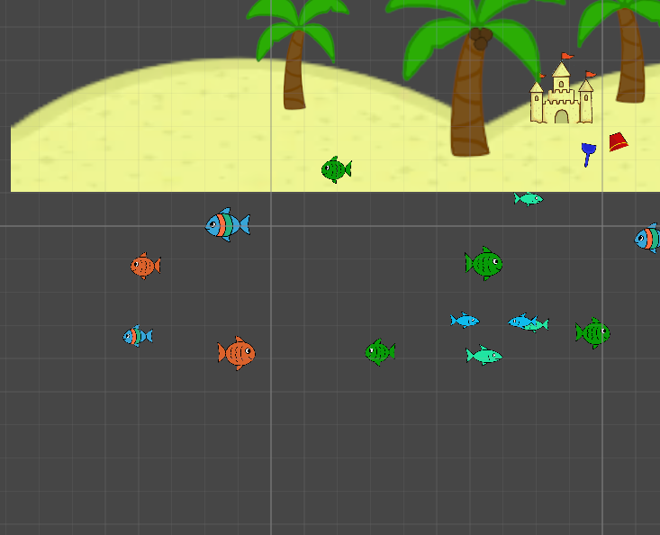
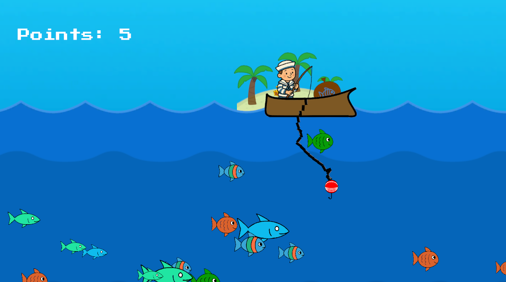

# Pecanje (Tehnička dokumentacija)
Ovo je videoigra u 2D stilu namjenjena igranju na mobilnim uređajima sa operacijskim sustavom Android.

## Kako sudjelovati u projektu?
Da biste mogli raditi na ovome projektu potrebno je prvo preuzeti sav kod iz ovog repozitorija. Zatim raspakirati preuzetu .zip datoateku. Nakon toga trebate preuzeti (ako već nemate) program Unity i pobrinuti se da imate EDITOR VERSION: 6000.0.41f1. Nakon toga u Unity Hub-u potrebno je u njega dodati raspakirani projekt. Prilikom prvog otvaranja projekta u Unity-ju važno je na alatnoj traci kliknuti na `Window -> Package Manager` i instalirati potrebne zavisnosti. Zadnji korak je da se u alatnoj traci klikne na `File -> Build Settings` i odabere platforma Android.

## Instalacija videoigre na Android uređaju
Otvaranjem [poveznice](https://drive.google.com/drive/folders/1GtseOcWSK3A1iaHUJy7SoWKX0MWt5HlE?usp=drive_link) možete preuzeti instalacijsku datoateku za Android uređaje. Nakon što ju preuzmete sa Google diska, pronađite gdje ste ju preuzeli na uređaju i instalirajte.

## Videoigra
Nakon instalacije videoigrice otvorite ju i dočekati će Vas početni zaslon, sa raznim vizaulnim elementima. Neki od tih su pozadinska slika, naziv igre i plavi "play" gumb koji pokreće igru. Također možete čuti pozadinsku glazbu.

Pritskom na play gumb, otvara se glavni prikaz igre. Otvaranje glavnog prikaza obavljamo pozivom funkcije `PlayGame()` koja se nalazi u `mainMenu.cs` datoateci.
```
public void PlayGame()
    {
        SceneManager.LoadSceneAsync(1);
    }
```
Ovako izgleda glavni prikaz u kojem će igrač provoditi najviše vremena.


### Čamac
Prvo što možemo vidjeti je čamac u kojem se igrač nalazi. Kada igrač nagne telefon u lijevo ili u desno može uočiti da se brod pomiče u određenu stranu i slika igrača se okrene u smjeru. Također, što više igrač nagne telefon čamac se brže kreće. Ono što je još važno za reći je to da dok se čamac miče reproducira se zvuk veslanja. To sve sam uspio napraviti koristeći akcelerometar ugrađen u gotovo sve pametne telefone i sljedećim kodom unutar `boat.cs`.
```
void FixedUpdate()
    {
        rb.linearVelocity = new Vector2(dirX, rb.linearVelocity.y);

        if (dirX != 0 && canControl)
        {
            if (dirX > 0)
                trans.eulerAngles = new Vector3(0, 180, 0);
            else
                trans.eulerAngles = new Vector3(0, 0, 0);

            AudioManagerGame.PlayLoopSFX(AudioManagerGame.instance.camac);
        }
        else
        {
            AudioManagerGame.StopLoopSFX();
        }
    }
```

Veličina igrivog prostora je ograničena. Stoga su i postavljene granice unutar kojih se igrač može kretati. Kada se čamac zabije u prvu prepreku on ne nakrene na stranu i oduzima se sposbnost upravljana čamcem igraču na jednu sekundu. Tako dobijemo dojam da smo se nasukali na kopno. 

Ta prepreka se može zaobići mudrim manevriranjem čamca, no kada igrač zaobiđe tu prepreku čeka ga zid koji ga prvo odbija nazad u igru i reproducira prigodni zvuk. Ako uspije i njega zaobići igrač se teleportira na poziciju sa početka igre.


Sva ta funkcionalnost postignuta je na idući način.
```
void OnTriggerEnter2D(Collider2D other)
    {
        if (other.CompareTag("CollisionWall"))
        {
            AudioManagerGame.PlaySFX(AudioManagerGame.instance.brodSeZabioUzid);
            Vector2 bounceDir = new Vector2(-Mathf.Sign(dirX), 0);
            rb.position += bounceDir * bounceBackDistance;
        }

        if (other.CompareTag("collisionWallNew"))
        {
            StartCoroutine(HandleCrash());
        }

        if (other.CompareTag("CollisionWallExtra"))
        {
            rb.position = new Vector2(-23f, 3f);
            trans.position = new Vector3(-23f, 3f, 1f);
        }
    }

    IEnumerator HandleCrash()
    {
        canControl = false;

        AudioManagerGame.PlaySFX(AudioManagerGame.instance.brodSeZabioUzid);

        float originalZ = trans.eulerAngles.z;
        trans.eulerAngles = new Vector3(trans.eulerAngles.x, trans.eulerAngles.y, originalZ + crashRotationZ);

        yield return new WaitForSeconds(crashDisableTime);

        trans.eulerAngles = new Vector3(trans.eulerAngles.x, trans.eulerAngles.y, originalZ);

        Vector2 bounceDir = new Vector2(-Mathf.Sign(dirX), 0).normalized;
        rb.linearVelocity = bounceDir * bounceForce;

        canControl = true;
    }
```
### Ribe

Kretanje riba je vrlo jednostavno napravljeno. U početnom trenutku sve idu u istom smjeru sve dok ne naiđu na nevidljivi zid s kojim se sudare. Onda se okrenu i istom brzinom nastave put u suprotnom smjeru, dok se ista radnja ne dogodi s druge strane igrivog prostora. Ribe imaju različite veličine i početnu brzinu.


```
using UnityEngine;

public class riba : MonoBehaviour
{
    public float speed = 10f;

    void Start()
    {
        rb.linearVelocity = new Vector2(-speed, 0f);
    }

    void OnTriggerEnter2D(Collider2D other)
    {
        if (other.CompareTag("CollisionWallFish"))
        {
            BounceX();
        }
    }

    void OnCollisionEnter2D(Collision2D collision)
    {
        if (collision.gameObject.CompareTag("CollisionWallFish"))
        {
            BounceX();
        }
    }

    private void BounceX()
    {
        speed = -speed;
        rb.linearVelocity = new Vector2(-speed, 0f);

        if (speed > 0f)
            trans.eulerAngles = new Vector3(0f, 0f, 0f);
        else
            trans.eulerAngles = new Vector3(0f, 180f, 0f);
    }
}
```

### Uže
U ovoj igri uže je najkompleksniji objekt zato što ima interakciju sa skoro svim ostalim objektima u igrici i sastoji se od čak četiri skripte. To su: `Rope.cs`, `RopeSegment.cs`, `UdicaHook.cs`, `FishHooking.cs`. Uže je podjeljeno na tri dijela. Gornji dio užeta koji se čvrsto pričvršćen za dno čamca. Donji dio užeta na kojeg je spojena udica. Udica je samo još jedan segment užeta, ali sa promjenjenim sprite-om i dodatnom skriptom. Treći dio užeta su svi segmenti između koji služe samo kako bismo dobili na duljini užeta. Na uže je dodano nekoliko unity komponenti kojima dobivamo kretanje užeta baš onako kako bi se ono kretalo i u pravom svijetu. 


Dio koda zadužen za generiranje užeta.
```
 void GenerateRope()
    {
        Rigidbody2D prevBod = hook;
        GameObject newSeg;
        HingeJoint2D hj;
        int index;

        for (int i = 0; i < numLinks; i++)
        {
            index = Random.Range(0, prefabRopeSegs.Length - 2);

            newSeg = Instantiate(prefabRopeSegs[index]);
            newSeg.transform.parent = transform;
            newSeg.transform.position = transform.position;

            hj = newSeg.GetComponent<HingeJoint2D>();
            hj.connectedBody = prevBod;

            prevBod = newSeg.GetComponent<Rigidbody2D>();
        }

        index = prefabRopeSegs.Length - 1;
        newSeg = Instantiate(prefabRopeSegs[index]);
        newSeg.transform.parent = transform;
        newSeg.transform.position = transform.position;

        hj = newSeg.GetComponent<HingeJoint2D>();
        hj.connectedBody = prevBod;
    }
```

#### Udica
Udica je zadužena za hvantanje riba. Na ribama i udici se nalazi poseban objekt koji prepoznaje kada se dodiruje s objektom te klase, a to je `Collider 2D`. Kada se riba dotakne s udicom repoducira se određeni zvuk i riba se rotira tako da gleda prema gore i poništava se njeno kretanje.

Kada udica koja na sebi ima uhvaćenu ribu dotakne čamac. Reproducira se drugačiji zvuk i pokreće se animacija koja prikazuje kako riba ide u vreću koju imamo u čamcu. Ono što se još dogodi u ovome trenutku je to da se igraču poveća broj bodova za jedan koji je stalno prikazan u gornjem lijevom rubu ekrana.


Povećavanje i prikazivanje broja bodova odrađuje skripta `PointsDisplay.cs`.
```
void Update()
    {
        bodoviText.text = "Points: " + bodovi;
    }

    public void AddPoints(int amount)
    {
        bodovi += amount;
    }
```

Kada igrač upeca sve ribe u moru unutar iste skripte u metodi `AddPoints()` dogodi se da se na igračevom ekranu ispiše poruka koja im čestita na uspijehu i reporducira zvuk.


```
if (bodovi > maxBodovi)
        {
            congratsText.gameObject.SetActive(true);
            congratsText.text = "CONGRATULATIONS!";
            congratsText.fontSize = 100;
            congratsText.alignment = TextAnchor.MiddleCenter;
            
            AudioManagerGame.PlaySFX(AudioManagerGame.instance.gotovoUpecaneSveRibe);
        }
```

### Upravljanje zvukovima
Za sve zvukove unutar videoigre brine se `AudioManager.cs` skripta. U njoj možemo pronaći metode koje jednom reproduciraju određeni zvučni efekt i koje beskonačno vrte određeni zvučni efekt, pod nazivima `PlaySFX()` i `PlayLoopSFX()` redom.

```
public static void PlaySFX(AudioClip clip)
{
    if (instance != null && clip != null)
    {
        instance.SFXsource.PlayOneShot(clip);
    }
}
```

```
public static void PlayLoopSFX(AudioClip clip)
{
    if (instance != null && clip != null)
    {
        if (instance.loopSFXsource.isPlaying && instance.loopSFXsource.clip == clip) return;

        instance.loopSFXsource.clip = clip;
        instance.loopSFXsource.loop = true;
        instance.loopSFXsource.Play();
    }
}
```
Navedene metode su namjenjene za reproduciranje samo zvučnih efeketa, iduća metoda je namjenja baš za reprodukciju glazbe i to posebno popisa za reprodukicu (eng. playlist).

```
private void PlayNextTrack()
    {
        if (musicPlaylist.Length == 0) return;

        musicSource.clip = musicPlaylist[currentMusicIndex];
        musicSource.Play();

        currentMusicIndex = (currentMusicIndex + 1) % musicPlaylist.Length;
    }
```

### Kamera
Kamera se kreće tako da glatko prati udicu. Glatko praćenje možemo vidjeti kao kašnjenje kamere za udicom.


`CameraFollow.cs`
```
LateUpdate()
{
    Vector2 targetPosition = (Vector2)currentTarget.position + offset;
        transform.position = Vector2.SmoothDamp(transform.position, targetPosition, ref velocity, smoothTime);
        transform.position = new Vector3(transform.position.x, transform.position.y, -10f);
}
```

### Optimizacija
Način na koji sam uspio rasteretiti korisnikov uređaj i uštedjeti mu bateriju je sljedeći. Umjesto da su sve sličice, posebno one za animacije zasebne. Složio sam ih u sprite sheet-ove, kako bi Unity game engine mogao odraditi manje "draw" poziva.
Također napravio sam skriptu `BackgroundLoop.cs` koja je inegrirana s kamerom i prati njen položaj u prostoru. Radi na sljedeći način. Umjesto da se učitava cijeli igrivi prostor igrača, učitava se samo ono što igrač može vidjeti. Također, osigurao sam da igrač neće nikada vidjeti učitavanje slika pod cijenu da se učitava malo više slike nego što bi u teoriji bilo potrebno. Jedna posljedica ove implementacije je da se može napraviti beskonačno veliki igrivi prostor.


## Autor
Ivan Frantal

## Posebne zahvale
- Svi koji su testirali i dali svoje povratne informacije na igru
- Unity Technologies na razvoju engina